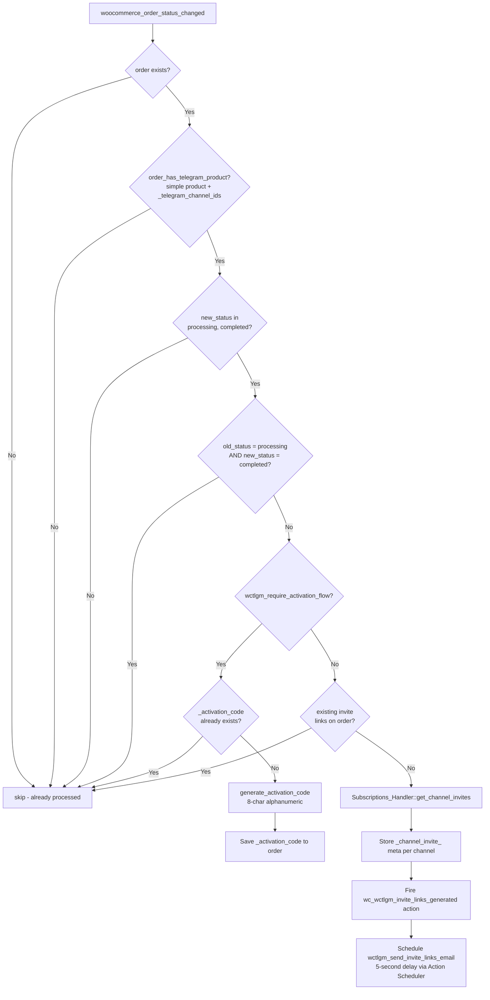
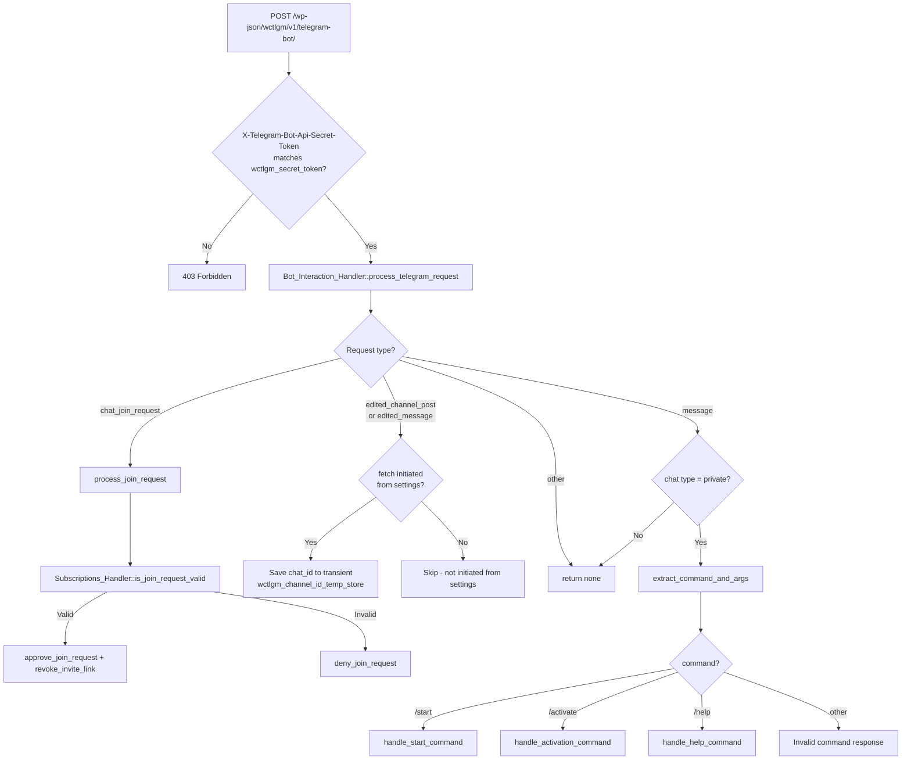
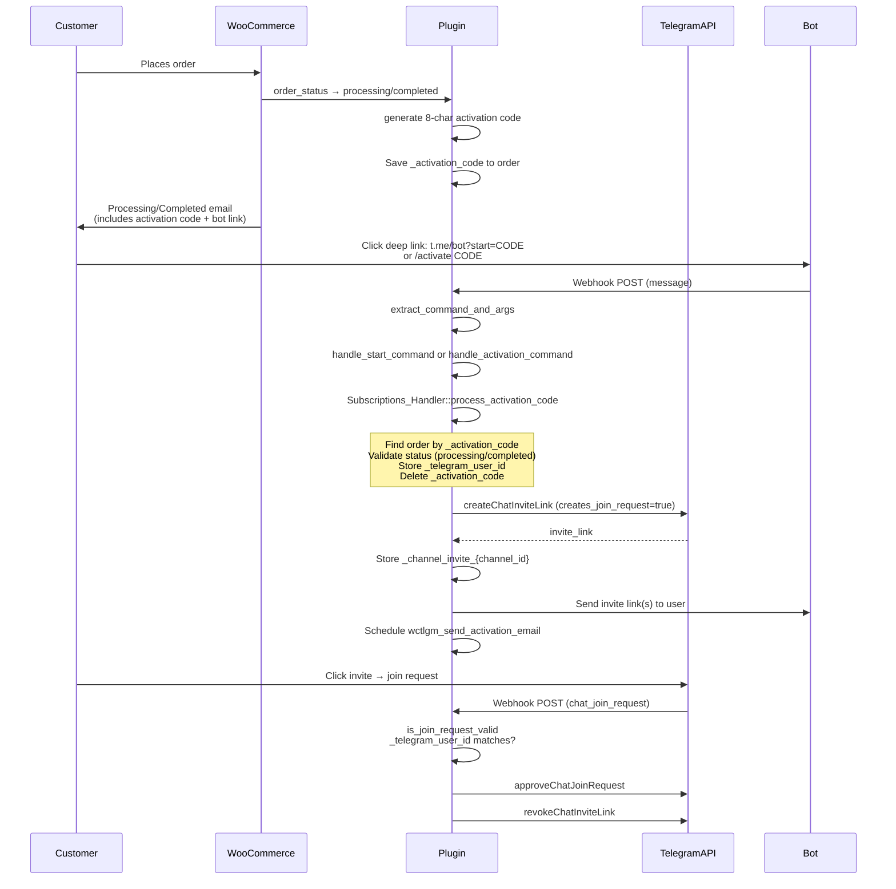
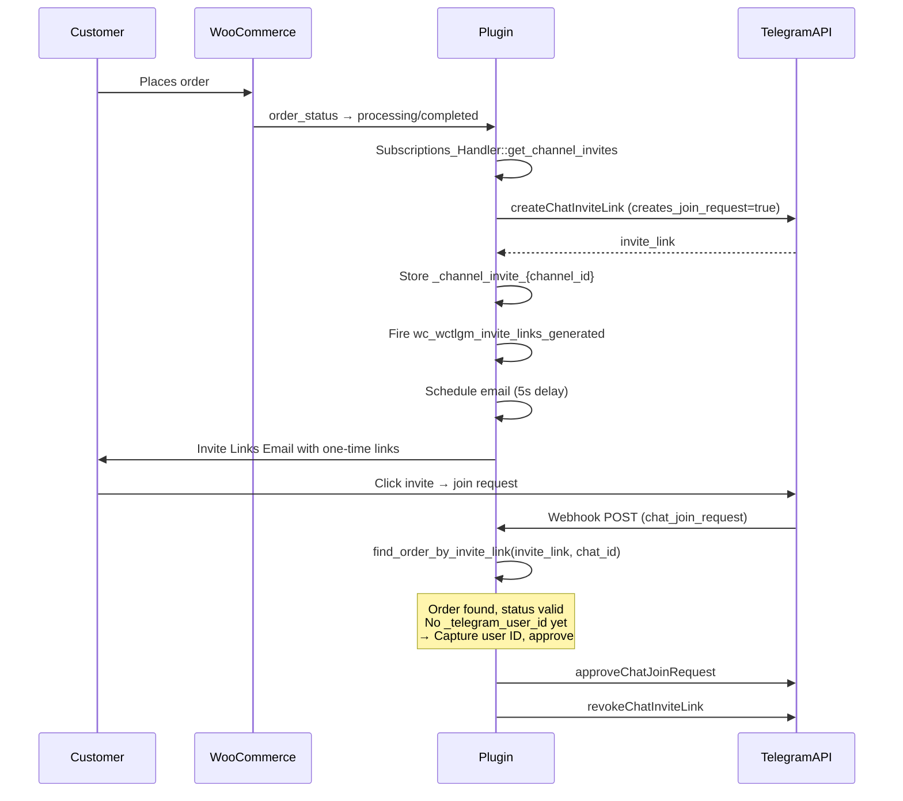
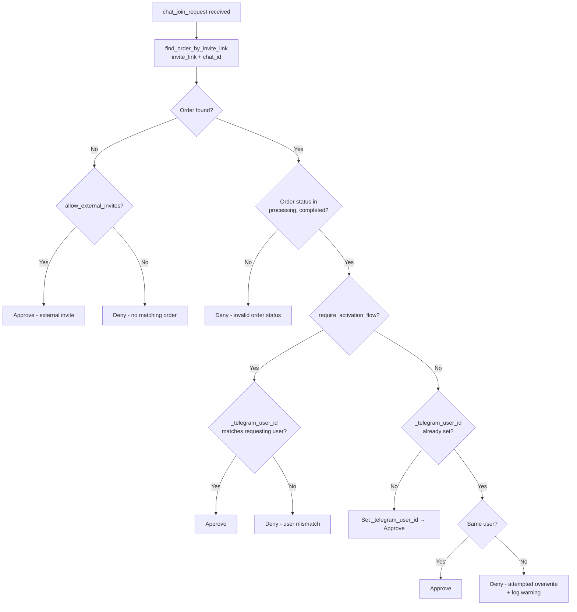
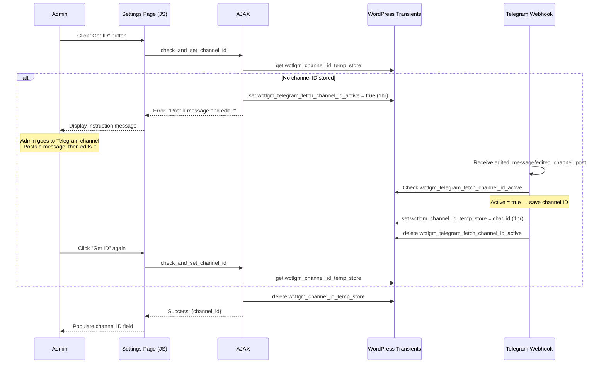

# Data Flow Diagrams

> **Version:** 1.6.0 | **Last updated:** 2026-02-24

## Order Processing Flow

## Telegram Webhook Processing Flow

## Activation Flow

## Direct Invite Flow (No Activation)

## Join Request Validation Flow

## Channel ID Fetch Flow (Settings Page)

